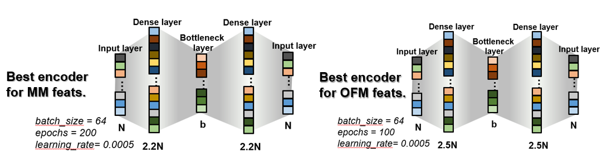

# Regular Autoencoder results
Different architectures and hyperparameters were tested to achieve good results with low compression loss.
- First: n-b and 3n-b architectures were tested with worse encoding. Two layer encoding (such as 2n-n-b, n-2n-b, etc.) wasn’t feasible for the full mp_gap but for smaller samples they degraded results, so we kept 2n-b architecture as reference
- Second: careful hyperparameter tuning of number of epochs, learning rate and batch size of the 2n-b model.
> Tested values were:  batch_size = 16, 32, 64; epochs = 50, 100, 200; learning_rate = 0.0005, 0.001 0.002. Bottleneck was fixed to 50% compression.
- Third: With hyperparameters set, dense layer in autoencoder was varied between 1.5, 1.6, 1.7, …, 2, 2.1, 2.2, …, 2.5; now testing compressions to 20%, 50% and 80%. The lower combined loss for each compression was evaluated to determine best architecture. 
- With best architecture the following encoders were considered for MatMiner features:  
> 0.4 compression ratio
> 0.6 compression ratio
> 0.8 compression ratio
> 1 compression ratio (no compression, just a remapping)

Architectures with best results for regular autoencoder:
